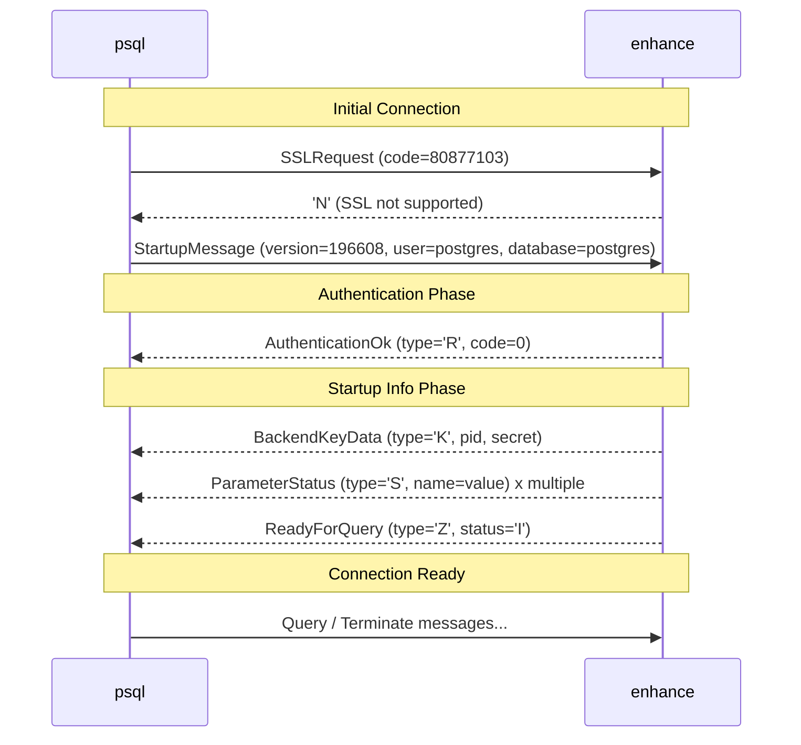

# Step 1: TCP Server & Handshake

> Implement Tokio listener. Handle StartupMessage (Big Endian) and SSLRequest. Achieve a "Trust" authentication state.

# This Week I Learned

## Uses Rust + Tokio Async Runtime

**Context**: RDBMS implementation requires handling multiple concurrent connections efficiently.

**Decision**: Use Rust with Tokio async runtime instead of thread-per-connection model.

**Consequences**:

- (+) Low memory overhead per connection (task vs thread)
- (+) Compile-time safety guarantees via `Send + Sync`
- (+) Rich ecosystem (`tokio::fs`, `tokio::net`, etc.)
- (-) Debugging async code can be challenging

## PostgreSQL Wire Protocol v3.0

**Context**: Need a well-documented protocol that allows testing with existing tools.

**Decision**: Implement PostgreSQL wire protocol v3.0 with Extended Query Protocol support.

**Consequences**:

- (+) Can use psql, pgAdmin, and standard PostgreSQL drivers for testing
- (+) Well-documented protocol with clear message formats
- (+) Extended Query Protocol enables prepared statements
- (-) Must implement complex startup sequence (SSLRequest, parameters, etc.)

## How PostgreSQL Wire Protocol 3.0 Begins

Since we use psql as a client, we needed to learn some aspects of the PostgreSQL Wire Protocol 3.0.

### Big-Endian Binary Encoding

PostgreSQL protocol uses network byte order (Big-Endian):

### Frontend

PostgreSQL protocol has a special initialization sequence:

1. **The first message has no message type byte** - Regular messages start with a 1-byte type identifier ('Q', 'X', etc.), but the very first message starts with just the length (i32)
2. **Special request codes** - Instead of a protocol version number, special values can appear:
   - `80877103` = SSLRequest (SSL connection negotiation)
   - `80877104` = GSSENCRequest (GSSAPI encryption)
   - `80877102` = CancelRequest (cancel running query)
   - `196608` = Protocol version 3.0 (normal StartupMessage)
3. **StartupMessage structure** - After the protocol version, null-terminated key-value pairs follow, ending with a final null byte

### Backend

Learned the specific message sequence required for psql to complete connection:

1. **AuthenticationOk** (type='R', i32=0) - Notify authentication success
2. **BackendKeyData** (type='K') - Process ID and secret key (used for CancelRequest)
3. **ParameterStatus** (type='S') - Send multiple server parameters (server_version, encodings, DateStyle, TimeZone, etc.)
4. **ReadyForQuery** (type='Z') - Transaction status ('I'=Idle, 'T'=Transaction, 'E'=Error)

Without sending this sequence correctly, psql cannot complete the connection.



### Testing with Real psql Client

Verified the implementation by connecting with an actual `psql` command:

- **Manual Verification** - Run the server with `cargo run` and connect using `psql -h localhost -p 5432 -U postgres`.
- **Real-world Compatibility** - Confirmed that the server correctly handles the initialization sequence (SSLRequest, StartupMessage) and sends the required startup info (AuthenticationOk, ParameterStatus, etc.) for `psql` to reach the prompt.
- **Clean Exit** - Verified that `\q` terminates the connection gracefully.

```bash
$ psql -h localhost -p 15432 -U postgres
psql (16.0)
Type "help" for help.

postgres=> \q
# Successfully connects and exits cleanly
```

## Implementing Async TCP Server with Tokio

Learned the basic patterns for async servers with Tokio:

- **`TcpListener::bind()` and `.accept()` loop** - Main thread accepts connections
- **`tokio::spawn()` for per-connection tasks** - Each connection processed in independent task for concurrency

## Handling Query Cancellation

Implemented the protocol-level query cancellation mechanism:

- **Connection Registry** - A global `Registry` tracks active connections by their PID and secret key.
- **CancelRequest Handling** - When a `CancelRequest` arrives, the server identifies the target connection via the registry and triggers a `CancellationToken` to stop its execution.
- **Cross-Task Communication** - Uses `tokio_util::sync::CancellationToken` for safe, async-friendly interruption of connection tasks.

## Concurrency Model: PostgreSQL vs enhance

Understanding the architectural difference in handling concurrent connections:

### PostgreSQL: Multi-Process Architecture

PostgreSQL uses a traditional multi-process model:

1. **Process Structure**
   - `postmaster`: Main process that accepts client connections
   - `postgres`: Backend process forked per connection (one OS process per client)
   - Utility processes: WAL writer, checkpointer, autovacuum, etc.

2. **Memory Sharing via OS Shared Memory**
   - **Shared Buffer Pool**: Disk page cache shared across all processes
   - **WAL Buffer**: Transaction log buffer
   - **Lock Table**: Table/row-level lock information
   - **Other**: Transaction state, statistics, etc.

3. **Synchronization Primitives**
   - POSIX semaphores, spinlocks, latches for controlling access to shared memory
   - Multiple processes coordinate access to the same page using locks

### enhance: Async Task-Based Architecture

enhance takes a modern Rust-centric approach:

1. **Concurrency Model**
   - Single process with Tokio async runtime
   - One async task per connection (not OS threads)
   - Lightweight task switching managed by Tokio executor

2. **Memory Sharing via Rust's Type System**
   - **`Arc<RwLock<Page>>` (maybe)**: Safe shared access to pages across tasks
   - No OS-level shared memory needed
   - Rust's ownership system prevents data races at compile time

3. **Synchronization Primitives**
   - `RwLock` for read/write access control
   - `Arc` for reference counting across tasks
   - Type safety guarantees memory safety without runtime overhead

**Trade-offs**: PostgreSQL's multi-process model provides strong isolation (process crashes don't affect others) and cross-platform compatibility. enhance's async model offers lower memory overhead per connection and leverages Rust's compile-time safety guarantees, making it ideal for this learning project.

# Looking ahead

## Future Module Structure

As the project grows, the codebase will be organized to maintain clear separation of concerns:

```
src/
├── protocol/      # Wire protocol messages (frontend/backend)
│                  # Binary encoding/decoding for PostgreSQL protocol
│
├── server/        # TCP listener and connection handling
│                  # Protocol state machine (StartupMessage → Ready)
│                  # Thin adapter: SQL string → engine → BackendMessage
│
├── storage/       # Storage engine (Week 5+)
│   ├── vfs/       # VFS trait (Memory/File implementations)
│   ├── buffer/    # Buffer pool manager with LRU
│   └── page/      # Slotted page structure, CRUD operations
│
├── sql/           # SQL processing (Week 13+)
│   ├── lexer/     # Tokenization
│   ├── parser/    # Recursive descent parser → AST
│   └── planner/   # AST → Query plan
│
├── execution/     # Volcano model executors (Week 15+)
│   ├── scan/      # SeqScan, IndexScan
│   ├── filter/    # WHERE clause evaluation
│   └── join/      # Nested loop join, etc.
│
├── index/         # B+Tree implementation (Week 19+)
│
└── transaction/   # Transaction manager and WAL (Week 21+)
```

**Design Principle**: The `server/` module remains a thin protocol handler. Core database logic (query execution, storage, transactions) lives in separate modules that can be tested independently of the wire protocol.
