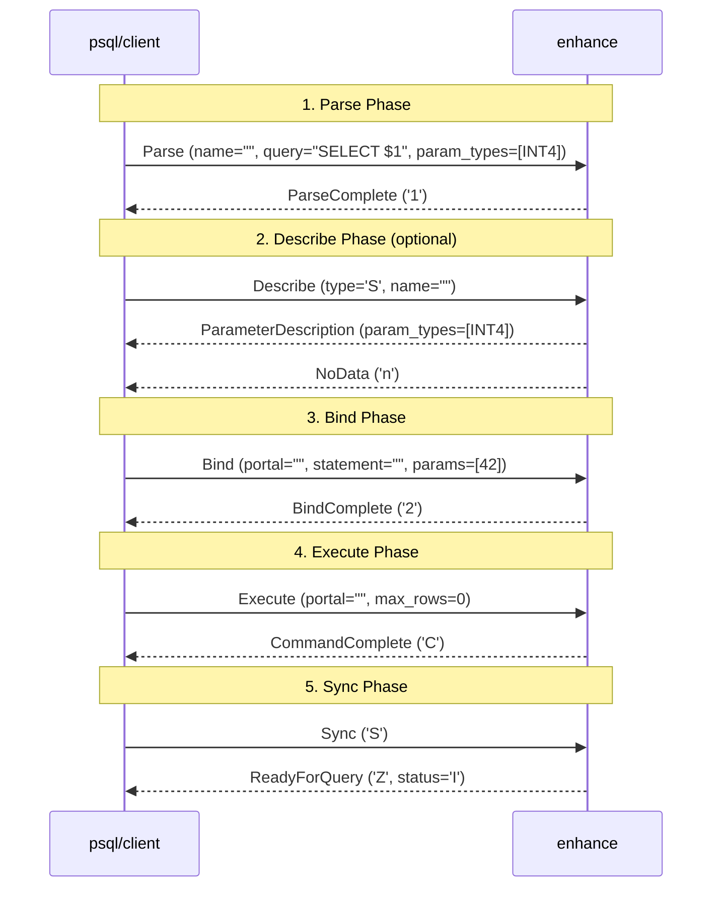

# Step 3: Extended Query Protocol (Parse/Bind/Execute)

> Implement stateful storage for PreparedStatement and Portal concept. Handle the complete flow from Parse, Describe, Bind, to Execute messages.

# This Week I Learned

## Extended Query Protocol: The Stateful Alternative

While Week 2 implemented the Simple Query Protocol (single-shot 'Q' message), this week tackled the more sophisticated Extended Query Protocol. This protocol enables prepared statements, parameterized queries, and efficient repeated execution—critical features for modern database applications.

### Why Extended Query Protocol Matters

The Extended Query Protocol provides several advantages over the Simple Query:

- **Prepared Statements**: Parse SQL once, execute many times with different parameters
- **Parameter Binding**: Safe parameter substitution without SQL injection risks
- **Binary Transfer**: Support for binary data formats (not just text)
- **Partial Execution**: Execute queries in batches with row limits
- **Explicit Transaction Control**: Fine-grained control over statement lifecycle

Modern PostgreSQL clients (JDBC, psycopg3, node-postgres) primarily use the Extended Query Protocol for better performance and security.

**NOTE**: This week implements the _protocol-level_ infrastructure for these features. The actual SQL parsing (Weeks 13-14), parameter substitution, and query execution (Weeks 15-16) will be implemented later. For now, we correctly handle the message flow and state management, returning dummy responses to verify protocol compliance.

### The Parse/Bind/Execute Cycle

The Extended Query Protocol introduces a stateful message flow:



### Frontend Messages Implemented

Extended Query Protocol adds 6 new message types from the client:

- **'P' (Parse)**: Creates a prepared statement from SQL query. Contains statement name (empty = unnamed), query text (may contain `$1`, `$2`... placeholders), and parameter type OIDs. Unnamed statements are cleared at `Sync`.
- **'B' (Bind)**: Binds parameter values to a prepared statement, creating a portal. Contains portal name, statement name, parameter formats/values, and result formats. Parameter length `-1` indicates NULL.
- **'D' (Describe)**: Requests metadata about a prepared statement (`'S'`) or portal (`'P'`). Server responds with `ParameterDescription` + `RowDescription`/`NoData` for statements, or just `RowDescription`/`NoData` for portals.
- **'E' (Execute)**: Executes a portal and returns results. Contains portal name and `max_rows` (0 = unlimited). Server sends `PortalSuspended` if more rows remain.
- **'C' (Close)**: Explicitly closes a prepared statement (`'S'`) or portal (`'P'`).
- **'S' (Sync)**: Marks end of extended query cycle. Server clears unnamed statement/portal, sends `ReadyForQuery`, and flushes output. Synchronization point where errors are guaranteed to be reported.

### Backend Messages Implemented

Added 5 new response message types:

- **'1' (ParseComplete)**: Confirms prepared statement was created
- **'2' (BindComplete)**: Confirms portal was created
- **'3' (CloseComplete)**: Confirms statement/portal was closed
- **'n' (NoData)**: Sent in response to Describe, indicating the statement/portal produces no result columns (e.g., INSERT/UPDATE/DELETE). Sent instead of RowDescription.
- **'t' (ParameterDescription)**: Lists parameter type OIDs for a prepared statement

### Stateful Storage: PreparedStatement and Portal

Implemented per-connection state management with `ConnectionState` that tracks:

- **PreparedStatement**: Stores the SQL query and parameter type OIDs
- **Portal**: Stores the bound statement name, parameter values, and format codes

### Testing with psql

Verified the implementation with real psql using Extended Query Protocol meta-commands:

```bash
$ psql -h localhost -p 15432 -U postgres

# Use psql meta-commands to directly trigger Extended Query Protocol
postgres=> SELECT $1::int \parse stmt1
postgres=> \bind_named stmt1 42 \g
 ?column?
----------
(0 rows)

postgres=> \close_prepared stmt1
```

These meta-commands (`\parse`, `\bind_named`, `\close_prepared`) directly send Parse/Bind/Execute/Close protocol messages, allowing us to verify the protocol implementation without full SQL parsing.

## Architecture Insights

### Unnamed vs Named Lifecycle

PostgreSQL distinguishes between unnamed and named objects:

| Object                   | Lifetime                        | Use Case                          |
| ------------------------ | ------------------------------- | --------------------------------- |
| Unnamed Statement (`""`) | Cleared at `Sync`               | One-off queries, implicit caching |
| Named Statement          | Explicit `Close` or session end | Reusable prepared statements      |
| Unnamed Portal (`""`)    | Cleared at `Sync`               | Single execution                  |
| Named Portal             | Explicit `Close` or session end | Cursors, partial result fetching  |

This design allows drivers to optimize simple queries (use unnamed) while supporting advanced use cases (use named).

### Error Handling in Extended Protocol

The Extended Query Protocol has different error semantics than Simple Query:

- **Errors don't auto-flush**: Multiple commands can be pipelined before `Sync`
- **Errors skip remaining messages**: If any message (e.g., `Parse`, `Bind`) fails, subsequent messages in the pipeline are ignored until `Sync`
- **Sync resets state**: After `Sync`, the connection returns to `ReadyForQuery` even if earlier errors occurred

This enables clients to pipeline multiple operations and handle errors in batch.

# Looking ahead

## What's Still Missing

- **Actual SQL Parsing**: Queries are still classified by prefix (Weeks 13-14)
- **Parameter Substitution**: `$1`, `$2` placeholders aren't replaced yet
- **Type Inference**: Server should infer parameter types if not specified
- **Binary Protocol**: All data currently treated as text
- **Result Set Data**: `RowDescription` and `DataRow` contain no actual columns/rows yet
- **Portal Suspension**: `max_rows` parameter is accepted but ignored
