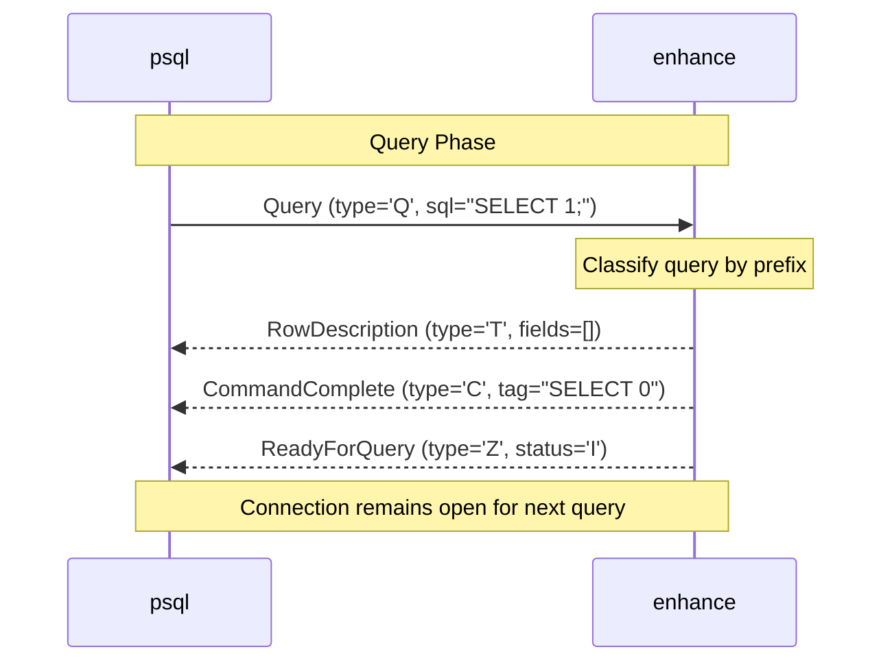

# Week 2

> Simple Query Protocol: Handle the 'Q' message. Implement the basic loop to return CommandComplete.

# This Week I Learned

## Simple Query Protocol

Implemented the basic query-response cycle of PostgreSQL's Simple Query Protocol:

### Frontend Messages

Added support for query-phase messages from the client:

- **'Q' (Query)**: Contains a null-terminated SQL string
- **'X' (Terminate)**: Signals connection termination (no body, just length=4)

The message reading loop now handles EOF gracefully, allowing clean disconnection when the client closes the connection.

### Backend Messages

Extended the protocol with query response messages:

- **'T' (RowDescription)**: Describes result set columns with metadata (column name, type OID, type size, etc.)
- **'D' (DataRow)**: Contains actual row data as an array of values
- **'C' (CommandComplete)**: Signals query completion with a command tag (e.g., "SELECT 0", "INSERT 0 0")
- **'I' (EmptyQueryResponse)**: Sent when the query string is empty

Each message type follows PostgreSQL's wire protocol specification, with proper length calculation and field encoding.

### Query Classification and Dummy Responses

Implemented a simple query classifier that recognizes common SQL commands by prefix:

- **SELECT**: Returns empty result set (RowDescription + CommandComplete "SELECT 0")
- **CREATE TABLE**: Returns CommandComplete "CREATE TABLE"
- **INSERT/UPDATE/DELETE**: Returns appropriate CommandComplete ("INSERT 0 0", "UPDATE 0", "DELETE 0")
- **BEGIN/COMMIT/ROLLBACK**: CommandComplete
- **SET**: CC
- **Unknown**: Returns ErrorResponse with syntax_error code (42601)

After each query response, the server always sends **ReadyForQuery** ('Z') to signal that it's ready to accept the next query.



### Testing with psql

Verified the implementation with comprehensive integration tests:

```bash
# Simple query
$ mise run psql -c "SELECT 1;"
# Returns: SELECT 0

# Multiple queries in one session
$ mise run psql -c "SELECT 1; SELECT 2;"
# Both queries processed successfully

# DDL commands
$ mise run psql -c "CREATE TABLE test (id INT);"
# Returns: CREATE TABLE

# Transaction commands
$ mise run psql -c "BEGIN; SELECT 1; COMMIT;"
# All commands accepted
```

All queries return dummy responses (empty result sets, zero affected rows), but `psql` can successfully send queries and receive protocol-compliant responses without errors.

# Looking ahead

## What's Still Missing

- **Actual SQL Parsing**: Queries are classified by simple prefix matching (Weeks 13-14)
- **Data Execution**: All queries return dummy responses (Weeks 15-16)
- **Extended Query Protocol**: Parse/Bind/Execute flow for prepared statements (Weeks 3-4)
- **Result Set Data**: RowDescription and DataRow contain no actual data yet
